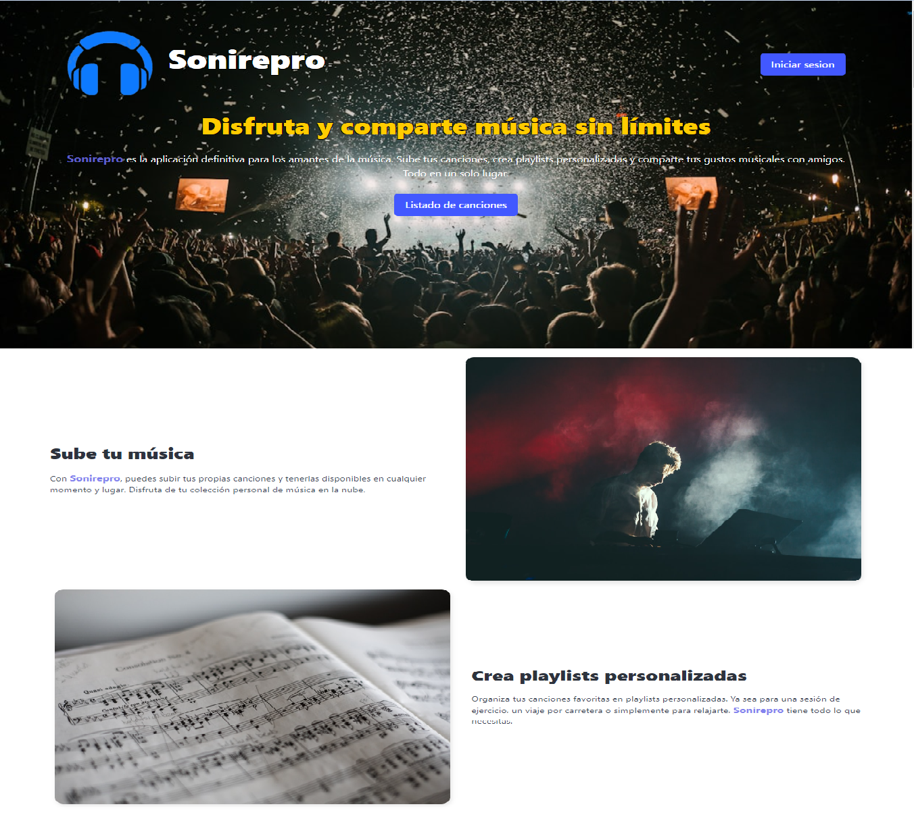

# Programacion III: Proyecto Final 
## Profesor
**Luis, Parada**
## Integrantes
**Luis, Peres**  
**Sara Patricia, Martinez**

---
 
## Descripción del Proyecto
Este proyecto simula un reproductor de música completo. Permite a los usuarios iniciar sesión, gestionar su perfil, y explorar un catálogo completo de canciones proporcionado por una API privada. Además, los usuarios pueden crear y gestionar sus propias listas de reproducción, añadiendo canciones a estas listas y visualizando su contenido. También incluye la funcionalidad para subir nuevas canciones a la API, ampliando así el repertorio disponible en la aplicación.


---


## Requisitos

Para ejecutar este proyecto, necesitarás tener instalados los siguientes requisitos:

- **Node.js** 
- **React** 
- **Vite** 

---
## Despliegue del proyecto
- Vercel 


## Instalación

```bash
git clone https://github.com/tuusuario/tu-proyecto.git
cd tu-proyecto
npm install
npm run dev
